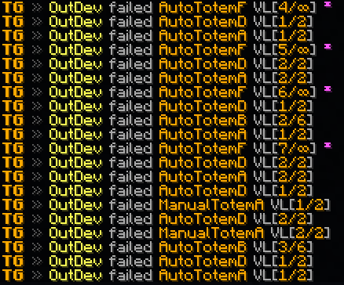

<div align="center">
  <h1>TotemGuard</h1>
  
  
  
  <br>
  <a href="https://www.spigotmc.org/resources/totemguard.119385/"></a>
  <a href="https://modrinth.com/plugin/totemguard"></a>
  <br>
  <a href="https://discord.deathmotion.com"></a>
</div>

## Overview

TotemGuard is a simple anti-cheat that tries to detect players who are using AutoTotem.
This plugin is designed to be as lightweight as possible and for the most parts operates asynchronously.
It is also designed to be as configurable as possible, allowing server owners to adjust the plugin to their needs.

### Requires PacketEvents

Ensure the [PacketEvents](https://modrinth.com/plugin/packetevents) library is installed on your server.

## Table of Contents

- [Overview](#overview)
    - [Requires PacketEvents](#requires-packetevents)
- [Showcase](#showcase)
- [Supported Platforms & Versions](#supported-platforms--versions)
- [Checks](#checks)
- [Features](#features)
- [Commands](#commands)
- [Permission Nodes](#permission-nodes)
- [Installation](#installation)
- [Compiling From Source](#compiling-from-source)
    - [Prerequisites](#prerequisites)
    - [Steps](#steps)
- [Credits](#credits)
- [License](#license)

## Showcase



## Supported Platforms & Versions

| Platform                        | Supported Versions |
|---------------------------------|--------------------|
| Paper, Folia, and related forks | 1.18 - 1.21.1      |

## Checks

### AutoTotem

- **AutoTotemA** - Click time difference between moving the totem to the offhand.
- **AutoTotemB** - Consistency of totem replacements
- **AutoTotemC** - Difference between consistency of totem replacements
- **AutoTotemD** - Packet sequence of totem replacement
- **AutoTotemE** - Consistency of totem replacements (alternative)

### BadPackets

- **BadPacketsA** - Opt-out message in a mod configuration channel

### ManualTotem

- **ManualTotemA** - Time difference between replacement after totem removal

## Features

- **Performance** - The plugin is designed to be as lightweight as possible.
- **Folia Support** - The plugin integrates with [Folia](https://papermc.io/software/folia), which is a Paper fork that
  adds regionised multithreading to the server.
- **Webhooks** - The plugin can send alerts and punishments to a Discord webhook.
- **Configurable** - The plugin is highly configurable, every setting can be adjusted during runtime.
- **Update Checker** - The plugin automatically checks for updates on startup.
- **Bypass** - The plugin allows players to bypass the checks if they have the `TotemGuard.Bypass` permission and the
  bypass setting is enabled.
- **Bedrock Exception** - The plugin doesn't check players who are using Bedrock Edition, preventing false positives.

## Commands

- `/totemguard` or `/tg` - Base Command
- `/totemguard info` - Displays information about the plugin.
- `/totemguard alerts` - Toggles alerts on/off.
- `/totemguard reload` - Reloads the configuration file (every single setting supports reloading on runtime).
- `/totemcheck` or `/checktotem` - Removes a totem from a player's inventory and checks if they are
  being quickly replaced.

## Permission Nodes

Operators (OPs) have these permissions by default (except the `TotemGuard.Debug` permission):

- `TotemGuard.*` - Grants access to all TotemGuard permissions.
- `TotemGuard.Alerts` - Allows the player to toggle alerts.
- `TotemGuard.Alerts.Others` - Allows the player to toggle alerts for other players.
- `TotemGuard.Check` - Allows the player to check if another player is using AutoTotem.
- `TotemGuard.Reload` - Allows the player to reload the configuration file.
- `TotemGuard.Bypass` - Allows the player to bypass the plugin's checks (if enabled in the configuration).
- `TotemGuard.Update` - Allows the player to get notified about updates.
- `TotemGuard.Debug` - Allows the player to see debug messages.

## Installation

1. **Prerequisites**: Install [PacketEvents](https://modrinth.com/plugin/packetevents).
2. **Download**: Get the latest release from
   the [GitHub release page](https://github.com/Bram1903/TotemGuard/releases/latest).
3. **Installation**: Move the downloaded plugin to your server's plugins directory.
4. **Configuration**: Customize settings in `config.yml`.
5. **Reload**: Run `/totemguard reload` to apply the changes.

## Compiling From Source

### Prerequisites

- Java Development Kit (JDK) version 21 or higher
- [Git](https://git-scm.com/downloads)

### Steps

1. **Clone the Repository**:
   ```bash
   git clone https://github.com/Bram1903/TotemGuard.git
   ```

2. **Navigate to Project Directory**:
   ```bash
   cd TotemGuard
   ```

3. **Compile the Source Code**:
   Use the Gradle wrapper to compile and generate the plugin JAR file:

   <details>
   <summary><strong>Linux / macOS</strong></summary>

   ```bash
   ./gradlew build
   ```
   </details>
   <details>
   <summary><strong>Windows</strong></summary>

   ```cmd
   .\gradlew build
   ```
   </details>

## Credits

Special thanks to:

- **[@Retrooper](https://github.com/retrooper)**: Author of [PacketEvents](https://github.com/retrooper/packetevents).

## License

This project is licensed under the [GPL3 License](LICENSE).
