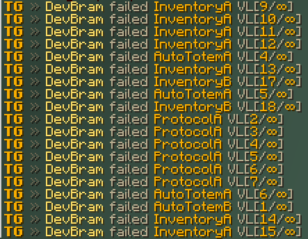

<div align="center">
  <h1>TotemGuard</h1>
  
  
  <br>
  <a href="https://modrinth.com/plugin/totemguard"></a>
  <a href="https://www.spigotmc.org/resources/totemguard.119385/"></a>
  <a href="https://discord.deathmotion.com"></a>
</div>

## Overview

TotemGuard is an anti-cheat focused on detecting AutoTotem and related combat cheats. It runs on Paper,
Folia, and Fabric, with an optional proxy bridge for Velocity and BungeeCord and an optional loader for
managed installs. The plugin is fully configurable at runtime, fleet-aware over Redis, and ships with a
public API for third-party integrations.

### Prerequisites

TotemGuard requires the [PacketEvents](https://modrinth.com/plugin/packetevents) library on each backend
server. The Fabric platform uses the Fabric build of PacketEvents.

### Sponsors

[](https://www.ej-technologies.com/jprofiler)

## Table of Contents

- [Showcase](#showcase)
- [Supported Platforms](#supported-platforms)
- [Checks](#checks)
- [Features](#features)
- [Loader (optional)](#loader-optional)
- [Proxy Bridge (optional)](#proxy-bridge-optional)
- [Fleet Mode](#fleet-mode)
- [Public API](#public-api)
- [Installation](#installation)
- [Compiling From Source](#compiling-from-source)
- [Credits](#credits)
- [License](#license)

## Showcase



## Supported Platforms

| Platform                            | Notes                                                        |
|-------------------------------------|--------------------------------------------------------------|
| Paper, Folia, and Paper-based forks | Standalone plugin. Spigot and CraftBukkit are not supported. |
| Fabric                              | Server-side mod, current Minecraft only.                     |
| Velocity, BungeeCord                | Optional bridge plugin for proxy-aware features.             |

## Checks

For per-check tuning, thresholds, and bypass details, see the [wiki](https://github.com/Bram1903/TotemGuard/wiki).

### AutoTotem

- **AutoTotemA** - Impossible click time difference.
- **AutoTotemB** - Suspicious totem-delay consistency (heuristic).

### Inventory

- **InventoryA** - Impossible action while an inventory is open.
- **InventoryB** - Movement during inventory interaction.
- **InventoryC** - Inventory interaction with no inventory open.

### Protocol

- **ProtocolA** - Slot change after a block place in the same tick.
- **ProtocolB** - Invalid slot change.
- **ProtocolC** - Attack and place in the same tick.
- **ProtocolD** - Multiple entities attacked in the same tick.
- **ProtocolE** - Duplicate consecutive player input packets.

### Tick

- **TickA** - Invalid tick packet sequence.
- **TickB** - Invalid acknowledgement order (keep-alive, transactions, teleport confirm).
- **TickC** - Invalid teleport acknowledgement.

### Manual

- **ManualTotemA** - Staff-forced totem check.

### Mods

TotemGuard detects mods via plugin channels and translation keys. Out of the box it knows
AutoTotem, Meteor, Tweakeroo, and Accurate Block Placement Reborn, and any additional mod can be added in
`mods.yml`. Each mod has its own severity (`LOG`, `KICK`, `BAN`, or `KICK_THEN_BAN`).

## Features

- **Multi-platform** - One codebase covers Paper, Folia, Paper-based forks, and Fabric.
- **Latency compensation** - Player ping is fully accounted for and has zero influence on checks.
- **Packet-based GUI** - Menus for plugin stats, top violators, player profiles, and flag history are
  rendered entirely through packets. Nothing ever enters the real inventory, so item duping is impossible
  by construction.
- **Live monitor** - View any player's inventory in real time, across servers when Redis is enabled,
  without touching their session.
- **Database support** - MySQL and MariaDB are first-class. Configurable retention for alert history.
- **Discord webhooks** - Forward alerts and punishments to a Discord channel via webhook.
- **Punishment system** - Per-check thresholds, `[BAN]` / `[KICK]` / `[GENERIC]` tagging, and a fake totem-pop
  ban animation rendered through packets (no inventory mutation).
- **Entity spoofing** - Randomises the health and absorption metadata of other players so attack-priority
  cheats cannot read true HP.
- **Follow and teleport** - Staff can follow flagged players or teleport via a configurable command hook.
  Works across servers when the proxy bridge is installed.
- **PlaceholderAPI** - Exposes server name, flag counts, mod state, and more through `%tg_*%` placeholders.
- **Update checker** - Periodic GitHub release polling, with results shared across the fleet when Redis is
  enabled so a rolling-restart cluster only fetches once.
- **Configurable at runtime** - YAML config with typed keys and live migrations. Most options apply without a
  restart.
- **Bypass permissions** - `TotemGuard.Bypass` node.
- **Jar integrity verification** - Every shaded artifact embeds an SHA-256 manifest validated at startup, so
  tampered builds refuse to enable.

## Loader (optional)

The TotemGuard Loader is an optional wrapper plugin (Paper or Fabric) that owns the runtime jar for you.
You drop the loader into `plugins/` or `mods/` once, point it at a version, and it handles downloading,
verifying, and class-loading the actual TotemGuard build through a custom classloader and a small JNI
`defineClass` shim. The previous build is unloaded cleanly, so reloads do not leak classloaders.

Running TotemGuard without the loader is fully supported. Pick whichever workflow fits the server.

- **You choose what gets loaded** - Auto-updating is not implied. Set `version` in `loader-config.yml` to a
  fixed value (e.g. `3.0.0`), to `LATEST` for the newest stable release, to `EXPERIMENTAL` for pre-releases,
  or to `GIT` for the latest commit. Sources are `GITHUB`, `MODRINTH`, or `LOCAL`.
- **Local drop bucket** - Drop a jar into the loader's `local/` directory and it is imported into the
  version catalog on the next start (or via `/tgloader import`). After import it shows up under
  `/tgloader load <version>` exactly like a remote-downloaded build. Useful for pushing internal builds
  across an entire network without giving anyone a CI account.
- **Air-gapped mode** - Set `source: LOCAL` to resolve `LATEST` from the drop bucket only. The loader never
  touches the internet but still gets jar integrity verification and reloads.
- **Hot reload** - `/tgloader load <version>` swaps the running jar in place. No server restart, no
  classloader leak, no lost state on plugins that hold an `api/` reference.
- **Integrity-checked** - Every imported jar must carry TotemGuard's SHA-256 stamp before it is allowed to
  load. Tampered or unsigned jars are refused.
- **Multiple builds side by side** - Several builds of the same version (for example a few
  `3.0.0-SNAPSHOT` iterations) are kept apart by their SHA-256 prefix in the version cache.

## Proxy Bridge (optional)

The Bridge is an optional plugin for Velocity and BungeeCord (one shaded jar covers both) that gives the
backend TotemGuard instances a single source of truth for proxy state. It is not required (TotemGuard on
each backend works without it), but it sharpens a few features that are otherwise approximate.

- **Accurate player presence** - The bridge tells every backend who is actually on the network, so quit and
  join events from server transfers stop flickering alerts and focus targets.
- **Cross-server teleport** - `/tg teleport <player>` resolves through the proxy, so staff can jump to a
  flagged player on any backend.
- **Redis transport** - The bridge talks to TotemGuard backends over Redis pub-sub. No extra ports, no
  custom plugin-message channels.
- **Drop-in** - Install the bridge jar on the proxy, share a Redis instance with the backends, and the
  backends discover the proxy automatically.

## Fleet Mode

Fleet mode is what TotemGuard calls running across more than one backend server with a shared Redis. It is
unrelated to the loader. The plugin works fine without it, on either a single server or many isolated ones.

Turning on `redis.enabled` lights up:

- **Cross-server alerts and monitor** - Alerts, focus, follow, and monitor state replicate to every backend.
- **Offline grace window** - During a proxy transfer the source server's quit fires before the destination
  server's join lands. A small grace window swallows that gap so transfers stay silent.
- **Shared caches** - Violation buffers and database query results can be reused across backends.

The loader has its own fleet layer that piggy-backs on the same Redis to roll out plugin-jar updates in a
staggered way across the cluster. Both layers can be used independently.

## Public API

TotemGuard publishes its API as `totemguard-api` to `https://maven.pvphub.me/bram`. Third-party plugins can
subscribe to flag events, query player state, and register integrations. See
[`tests/api-paper-test-plugin`](tests/api-paper-test-plugin) for a working sample.

```kotlin
repositories {
    maven("https://maven.pvphub.me/bram")
}

dependencies {
    compileOnly("com.deathmotion.totemguard:totemguard-api:1.0.0-SNAPSHOT")
}
```

## Installation

1. **Prerequisites**: install [PacketEvents](https://modrinth.com/plugin/packetevents) on every backend
   server.
2. **Download**: grab the latest release from the
   [GitHub release page](https://github.com/Bram1903/TotemGuard/releases/latest). Pick the artifact that
   matches your platform (Paper, Fabric, Loader, or Bridge).
3. **Install**: drop the jar into `plugins/` (Paper or proxy) or `mods/` (Fabric).
4. **Configure**: edit `config.yml`, `checks.yml`, `messages.yml`, and `mods.yml` to taste.
5. **Reload**: apply changes with `/totemguard reload`, or use `/tgloader` if you are running the loader.

## Compiling From Source

### Prerequisites

- Java Development Kit (JDK) 25 or higher
- [Git](https://git-scm.com/downloads).

The prebuilt loader native binaries are checked into the repository, so a standard `./gradlew build` does
not need zig. Only install [Zig](https://ziglang.org/) (and run `./gradlew :loader:plugin:compileNative`)
if you are changing `loader/plugin/src/main/c/native.c` and need to regenerate the shipped binaries.

### Steps

1. **Clone the repository**:
   ```bash
   git clone https://github.com/Bram1903/TotemGuard.git
   ```
2. **Navigate to the project directory**:
   ```bash
   cd TotemGuard
   ```
3. **Build every shaded artifact**:

   <details>
   <summary><strong>Linux / macOS</strong></summary>

   ```bash
   ./gradlew build
   ```
   </details>
   <details>
   <summary><strong>Windows</strong></summary>

   ```cmd
   .\gradlew build
   ```
   </details>

   Jars land in the root `build/` directory as `TotemGuard-Paper-<version>.jar`,
   `TotemGuard-Fabric-<version>.jar`, `TotemGuard-Loader-<version>.jar`, and
   `TotemGuard-Bridge-<version>.jar`.

## License

This project is licensed under the [GPL3 License](LICENSE).
